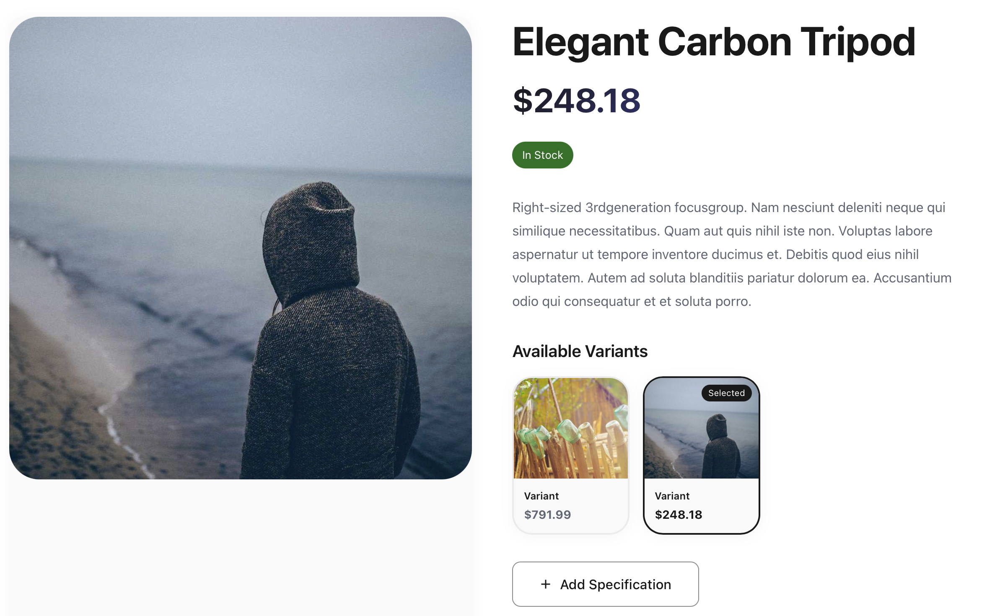
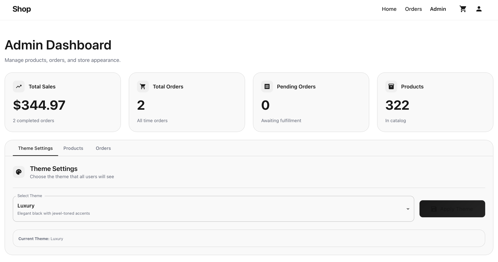

# Shop API

A modern e-commerce REST API built with [BaseAPI](https://github.com/TimAnthonyAlexander/base-api) - a lightweight PHP 8.4+ framework.
Frontend built in web/ using React + MUI.

## Features

- **Product Management** - Create and retrieve products with stock tracking
- **Shopping Basket** - Session-based shopping cart functionality
- **Order Processing** - Convert baskets to orders
- **User Authentication** - Registration, login, and session management
- **File Uploads** - Upload, retrieve, and delete files with validation
- **Background Jobs** - Async email sending, database backups, image processing
- **Health Checks** - Monitor database and cache status

## Screenshots






## Requirements

- **PHP 8.4+** with extensions: curl, json, mbstring, pdo
- **Composer** for dependency management
- **MySQL 8.0+**, **PostgreSQL 14+**, or **SQLite** for database

## Installation

### 1. Install Dependencies

```bash
composer install
```

### 2. Configure Environment

```bash
cp .env.example .env
```

Edit `.env` with your database configuration:

```env
APP_ENV=local
APP_DEBUG=true
APP_URL=http://127.0.0.1:7879

DB_DRIVER=mysql
DB_HOST=127.0.0.1
DB_PORT=3306
DB_NAME=shop
DB_USER=root
DB_PASSWORD=
```

### 3. Set Up Database

```bash
php mason migrate:generate
php mason migrate:apply
```

### 4. Start the Server

```bash
php mason serve
```

The API will be available at `http://127.0.0.1:7879`

## API Endpoints

### Authentication

#### Register
```http
POST /auth/signup
Content-Type: application/json

{
  "name": "John Doe",
  "email": "john@example.com",
  "password": "secure-password"
}
```

#### Login
```http
POST /auth/login
Content-Type: application/json

{
  "email": "john@example.com",
  "password": "secure-password"
}
```

#### Get Current User
```http
GET /me
Cookie: PHPSESSID=...
```

#### Logout
```http
POST /auth/logout
Cookie: PHPSESSID=...
```

### Products

#### Get Product
```http
GET /product/{id}
Cookie: PHPSESSID=...
```

#### Create Product (Admin only)
```http
POST /product
Cookie: PHPSESSID=...
Content-Type: application/json

{
  "title": "Amazing Product",
  "description": "Product description",
  "price": 29.99,
  "stock": 100
}
```

### Basket

#### Get Basket
```http
GET /basket
Cookie: PHPSESSID=...
```

#### Modify Basket
```http
POST /basket
Cookie: PHPSESSID=...
Content-Type: application/json

{
  "product_id": "product-uuid",
  "action": "add"  // or "remove"
}
```

### Orders

#### Get Order
```http
GET /order/{id}
Cookie: PHPSESSID=...
```

#### Create Order from Basket
```http
POST /order
Cookie: PHPSESSID=...
```

### File Uploads

#### Upload File
```http
POST /files/upload
Cookie: PHPSESSID=...
Content-Type: multipart/form-data

file: (binary)
```

Supported formats: `jpg`, `jpeg`, `png`, `gif`, `pdf`, `doc`, `docx`  
Max size: 5MB

#### Get File Info
```http
GET /files/info?path=uploads/filename.jpg
Cookie: PHPSESSID=...
```

#### Delete File
```http
DELETE /files
Cookie: PHPSESSID=...
Content-Type: application/json

{
  "path": "uploads/filename.jpg"
}
```

### System

#### Health Check
```http
GET /health?db=1&cache=1
```

#### OpenAPI Specification (Local only)
```http
GET /openapi.json
```

## Background Jobs

### Available Jobs

- **SendEmailJob** - Async email delivery
- **BackupDatabaseJob** - Database backups with compression
- **ProcessImageJob** - Image resizing, cropping, thumbnails
- **CallExternalApiJob** - External API calls with retry logic

### Running Queue Worker

```bash
# Set queue driver in .env
QUEUE_DRIVER=database

# Start worker
php mason queue:work
```

### Dispatching Jobs

```php
use App\Jobs\SendEmailJob;

dispatch(new SendEmailJob(
    to: 'user@example.com',
    subject: 'Welcome',
    body: 'Welcome to our shop!'
));
```

## Development

### Quality Tools

```bash
# Run tests
composer phpunit

# Static analysis
composer phpstan

# Code modernization check
composer rector

# Auto-fix
composer rector:fix

# Install git hooks
composer setup-hooks
```

## Project Structure

```
shop/
├── app/
│   ├── Auth/              # Authentication providers
│   ├── Controllers/       # HTTP request handlers
│   ├── Jobs/              # Background job classes
│   ├── Middleware/        # Request middleware
│   ├── Models/            # Database models
│   ├── Providers/         # Service providers
│   └── Services/          # Business logic services
├── config/                # Configuration files
├── public/                # Web server root
├── routes/                # Route definitions
├── storage/               # File storage and logs
└── mason                  # CLI tool
```

## Models

- **User** - User accounts with password hashing
- **Product** - Product catalog with pricing and stock
- **Basket** / **BasketItem** - Shopping cart functionality
- **Order** / **OrderItem** - Order management
- **ApiToken** - API token authentication
- **ProductImage** - Product image storage

## License

MIT License

Built with [BaseAPI](https://github.com/TimAnthonyAlexander/base-api)
